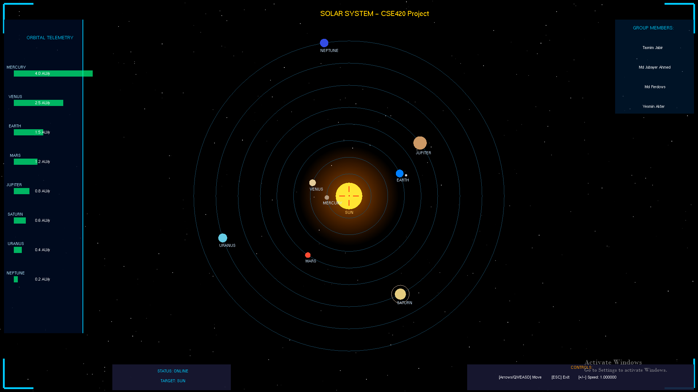

# Solar System
A simulation of the Solar System using OpenGL to visually represent planetary orbits, movements, and interactions. Users can interact with the simulation, adjusting speed and zoom levels, and canexplore the solar system from differentperspectives

Screenshot:
 
